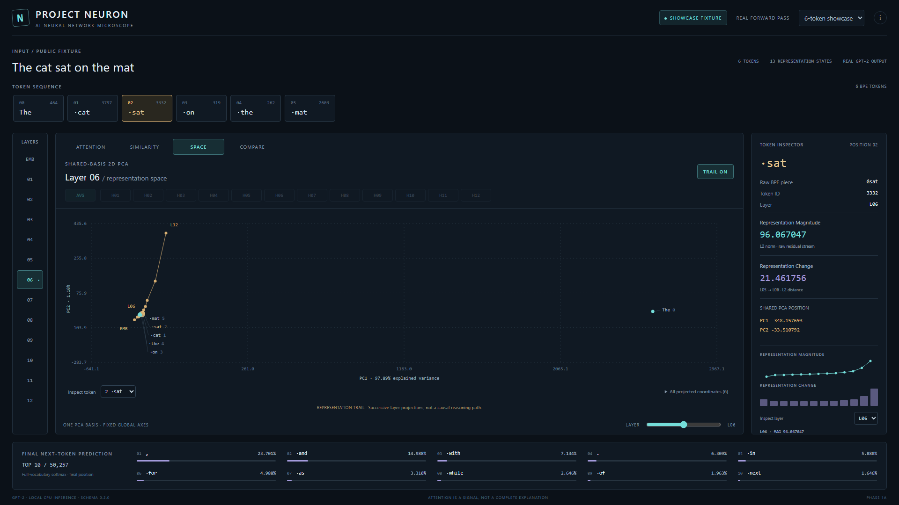
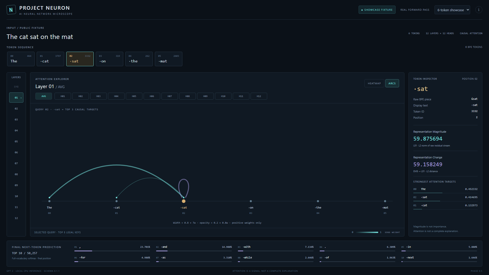
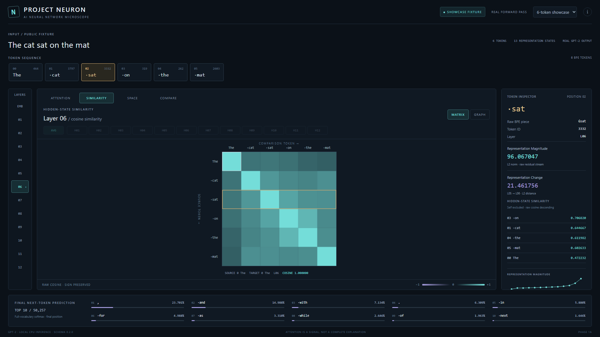
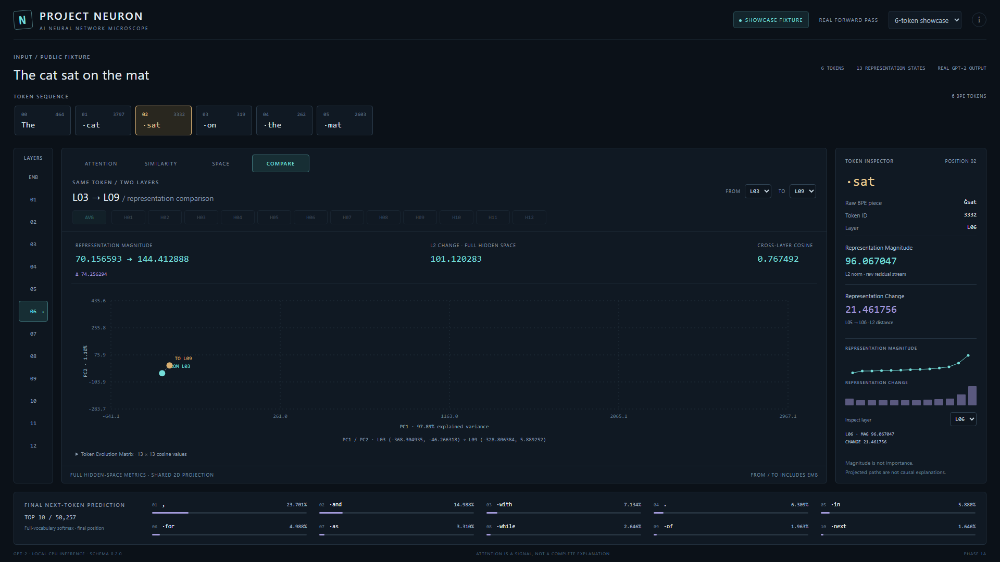
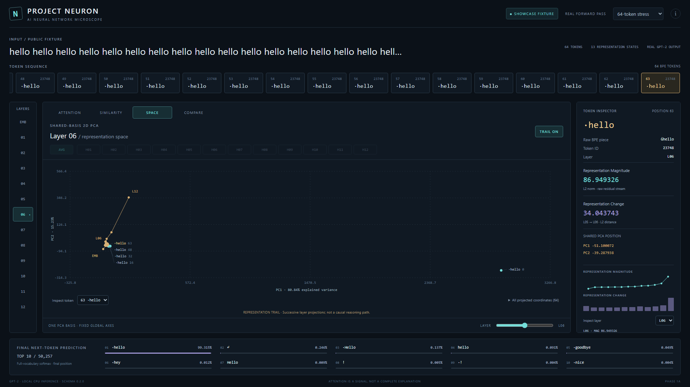
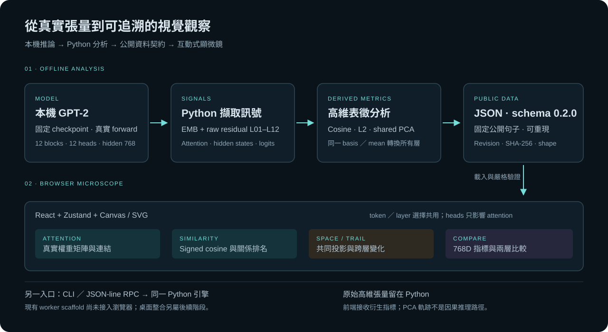

# Project NEURON｜AI 神經網路顯微鏡

**把 Transformer 的內部訊號，轉成可以觀察、比較與驗證的互動式視覺化。**

本專案以本機 GPT-2 的真實前向推論為資料來源，觀察 token 在不同層的注意力、向量相似度與表徵變化。它是一套模型分析工具，而非聊天介面：畫面上的矩陣、座標與數值，都能追溯至模型輸出與明確的計算方法。

目前完成 **Phase 1A：瀏覽器版 Microscope Core**。Python 引擎可以執行本機推論；瀏覽器展示事先由引擎計算的公開測試資料，尚未接入即時輸入或桌面封裝。

[](https://github.com/oliverchenOVO/project-neuron/actions/workflows/phase0.yml)
[](https://github.com/oliverchenOVO/project-neuron/actions/workflows/phase0-5.yml)

[三分鐘導覽](#三分鐘審閱導覽) · [功能展示](#功能展示) · [系統架構](#系統架構) · [方法與研究切入點](#方法與研究切入點) · [實驗與驗證](#實驗與驗證) · [本機執行](#本機執行) · [開發歷程](#開發歷程)



> 真實程式截圖，1920 × 1080。輸入為 `The cat sat on the mat`，選取 `sat`、SPACE 模式、第 06 層，並開啟 TRAIL。軌跡連接同一個 token 從 EMB 到 L12 的投影位置。

## 三分鐘審閱導覽

| 時間 | 觀察重點 | 可直接查看的證據 |
|---|---|---|
| 第 1 分鐘 | 先看 SPACE 主圖，再比較 Attention 與 Similarity；理解三者分析的是不同訊號 | [功能展示](#功能展示)、[架構圖](#系統架構) |
| 第 2 分鐘 | 以同一 token 的 L03 → L09 為例，區分向量範數差、高維距離與二維位移 | [中文分析案例](docs/REVIEWER_GUIDE.zh-TW.md#sat-layer-comparison) |
| 第 3 分鐘 | 核對資料來源、測試、效能定義與原始提交，而不只看介面截圖 | [驗證報告](docs/PHASE1A_VALIDATION.md)、[完整歷史](https://github.com/oliverchenOVO/project-neuron/commits/main/) |

不必安裝即可閱讀上述圖文；要操作介面可使用已提交的公開資料，不必先下載模型。[審閱指南](docs/REVIEWER_GUIDE.zh-TW.md)整理技術問題與證據的對應，[重現指南](docs/REPRODUCIBILITY.zh-TW.md)則分開說明兩種執行路徑。

## 為什麼做這個專案？

語言模型的輸出容易觀察，但產生輸出的中間表徵仍難以直接檢視。本專案把問題拆成三個可驗證的觀察方向：

1. **注意力如何分配？** 比較不同層、不同 head 的 query–key 權重。
2. **內部表徵如何變化？** 追蹤同一個 token 的向量範數、相鄰層差異與共享投影座標。
3. **哪些關係可以被量化？** 用原始高維向量計算 cosine similarity 與 L2 distance，再以視覺化輔助比較。

設計重點是把「模型數值 → 分析方法 → 介面呈現 → 驗證證據」連成一條可追溯的流程。這也是本專案作為研究與工程作品的核心：除了展示畫面，也保留資料來源、方法限制、測試與逐步開發紀錄。

## 功能展示

### 1. ATTENTION｜觀察注意力矩陣與連結

Heatmap 顯示完整 query–key 矩陣；選取 token 後，Arc View 顯示該 query 對各 token 的注意力分配。可切換 L01–L12、H01–H12，或使用 12 個 heads 的算術平均 AVG。未來位置保留因果遮罩的零值，自身注意力也保留。



*此圖保留 Phase 0.5 的真實操作畫面：L01／AVG、選取 sat。原始圖與視覺回歸基準均保留在 Git 歷史中。*

### 2. SIMILARITY｜觀察 token 表徵之間的關係

直接使用該層 hidden states 的 cosine similarity。矩陣色階固定為 **−1 → 0 → +1**，保留負值；右側排名排除自身，依原始 cosine 由大到小排序。滑鼠與鍵盤均可讀取精確的來源、目標與數值。



另提供固定 token 順序的關係圖。半徑是 cosine 的有界單調映射，負向連結使用虛線；它不是高維向量之間的實際幾何距離。

[查看關係圖截圖](docs/screenshots/phase1a-similarity-graph.png)

### 3. SPACE／TRAIL｜在共同座標軸上比較不同層

將 EMB 與 L01–L12 的表徵合併，**只擬合一次 PCA**，所有層共用同一個全域平均與投影 basis。切換 layer 時，座標軸範圍固定，token 依真正的投影結果移動；支援手動 scrubber、240 ms 線性過渡，以及減少動態效果偏好。

開啟 TRAIL 可觀察單一 token 的 13 個真實投影位置。圖上標示 PC1／PC2 的解釋變異比例，並提供完整數值列表。首頁主圖即為此模式；[不含軌跡的 SPACE 截圖](docs/screenshots/phase1a-shared-space.png)可用來比較所有 token 的分布。

### 4. COMPARE｜比較同一 token 在兩層的表徵

FROM／TO 可以選 EMB–L12，並列出兩層 magnitude、magnitude 差值、**768 維原始向量的 L2 distance 與跨層 cosine**，以及共同 PCA 座標。下方的 Token Evolution Matrix 可讀取完整 13 × 13 跨層 cosine。



以公開展示資料中的 `sat` 為例：L03 → L09 的 L2 distance 為 **101.120283**，cosine 為 **0.767492**。這些值由高維向量直接計算，沒有以畫面上的二維位移替代。

### 5. 64-token 與桌面尺寸驗證

64-token 場景保留全部節點及矩陣資料。對重疊的投影點，仍可透過 token 選擇器與數值列表逐一檢視；視覺標籤採稀疏顯示，不為了排版而移動科學座標。



另驗證 [1440 × 900](docs/screenshots/phase1a-desktop-1440.png) 與 [1280 × 720](docs/screenshots/phase1a-desktop-1280.png)。小尺寸畫面的 inspector 使用內部捲動；主要操作與最終預測保留在視窗內。

## 系統架構



**目前瀏覽器的資料路徑：** 本機 GPT-2 → Python 分析 → 固定公開資料 JSON → schema 驗證 → React 視覺化。瀏覽器不執行推論，也沒有後端推論 HTTP 服務。

Python 另外提供 CLI 與 JSON-line RPC scaffold，可透過 stdin／stdout 執行分析；這個入口尚未與瀏覽器串接。完整架構與數學定義見 [ARCHITECTURE.md](docs/ARCHITECTURE.md)，共享表徵方法補充見 [Phase 1A 設計](docs/PHASE1A_DESIGN.md)。

| 層次 | 技術 | 責任 |
|---|---|---|
| 模型與推論 | Python、PyTorch、Transformers | 載入固定版本 GPT-2，擷取真實 attention、hidden states 與 logits |
| 表徵分析 | float64 線性代數、cosine、L2、PCA | 計算可追溯的層內／跨層指標與共同座標 |
| 資料契約 | JSON、TypeScript、runtime validation | 驗證版本、shape、有限值、對稱性與固定軸域 |
| 互動介面 | React、Zustand、Canvas、SVG | 四模式切換、精確選取、矩陣、關係圖與跨層投影 |
| 測試與交付 | pytest、Vitest、Playwright、GitHub Actions | 真實模型驗證、互動測試、視覺回歸與 Windows CI |

## 方法與研究切入點

### 保持各層表徵的定義一致

GPT-2 有 12 個 Transformer blocks。本專案觀察 **EMB + 12 個 raw post-block residual streams**，共 13 個狀態，每個 token 的向量維度為 768。

Transformers 回傳的最後 hidden state 已經經過 `ln_f`。引擎透過暫時的 forward hooks 取得正規化前的 block 輸出，讓相鄰層變化保持一致的定義，也避免 Logit Lens 重複套用正規化。Hooks 在例外發生時仍會移除。

### 讓跨層投影具有共同基準

逐層各自擬合 PCA 會產生不同座標軸，因此不能直接把座標連成共同空間中的軌跡。本專案保留舊 per-layer PCA 資料，但 SPACE／TRAIL 使用新的 **shared PCA**：

- 將所有層、所有 token 合併為 `[13 × tokens, 768]`，做一次全域中心化。
- 以 CPU float64 對較小的 Gram／covariance 矩陣進行對稱特徵分解，求出共同的兩個主成分。
- 用同一組 mean／components 轉換每一層；固定軸域涵蓋全部層並加入 8% padding。
- 以測試比較兩種 solver 分支與完整 SVD，並驗證真實模型的共同轉換、退化案例與重現性。

二維投影仍會失去資訊。因此 COMPARE 的 cosine 與 L2 使用原始 768 維向量計算，投影只作為觀察輔助。

### 讓畫面與資料都可被驗證

公開展示只使用固定句子 `The cat sat on the mat` 與 ` hello` 重複 64 次。每份資料由真實 checkpoint 重新推論兩次，清除快取後比對完整序列化結果；manifest 記錄模型 revision、schema、generator version 與 SHA-256。

介面切換保留同一份 analysis 物件，避免反覆複製大型 JSON。資料載入、JSON parse、schema 驗證、狀態更新、render 與互動成本分開量測，讓效能報告能指出成本來自哪個階段。

## 實驗與驗證

以下為已完成 Phase 1A 的紀錄，詳細原始樣本與硬體條件見 [驗證報告](docs/PHASE1A_VALIDATION.md)，目前 CI 狀態可從頁首徽章與 [Actions 歷史](https://github.com/oliverchenOVO/project-neuron/actions)查看。

| 驗證項目 | 結果 |
|---|---|
| Python／真實模型／RPC 測試 | 50 項通過；沒有跳過真實模型測試 |
| 前端測試 | 57 項通過 |
| Playwright E2E | 11 項通過 |
| 視覺回歸 | 新增 6 個核心場景；原有 4 個 PNG 基準保持不變 |
| Production build | TypeScript 與 Vite 通過 |
| 遠端 CI | Windows 上的 Engine 與 Browser workflows 通過 |
| 資料重現性 | 兩份公開資料均通過獨立 uncached bytes 比對 |

在 i9-12900H／Windows／1920 × 1080 的實測中：

| 指標 | 6-token | 64-token |
|---|---:|---:|
| 最慢互動種類的 JS p95 | 7.3 ms | 8.6 ms |
| 真實 JSON 資料大小 | 139,283 bytes | 9,042,891 bytes |
| 加入共同 PCA／跨層指標後的資料增幅 | +40.15% | +4.86% |
| 引擎 analysis 中位數：加入前 → 加入後 | 314 → 370 ms | 535 → 1,086 ms |

互動 JS 指 handler 到 React layout commit；不包含資料下載、解析、模型推論或螢幕呈現延遲。引擎 analysis 也不包含模型載入與 JSON encoding。數字是指定硬體上的觀察，沒有推論為所有機器的效能保證。

[模型驗證](docs/PHASE0_VALIDATION.md) · [初代瀏覽器驗證](docs/PHASE0_5_VALIDATION.md) · [Microscope Core 驗證](docs/PHASE1A_VALIDATION.md) · [機器可讀取的證據](docs/evidence/phase1a-validation.json)

## 本機執行

詳細環境、操作步驟、離線範圍與常見問題見 [中文重現指南](docs/REPRODUCIBILITY.zh-TW.md)。以下為快速入口。

### 只看瀏覽器展示

需要 Node.js；CI 使用 Node 22。Git 內已包含固定公開展示資料，不需要先下載模型。

```powershell
git clone https://github.com/oliverchenOVO/project-neuron.git
cd project-neuron/frontend
npm ci
npm run build
npm run preview
```

開啟 [http://127.0.0.1:4173](http://127.0.0.1:4173)。選取 `sat` → SIMILARITY → L01／L06／L12 → SPACE → TRAIL ON → COMPARE，即可重現展示流程。右上選單可切換 64-token 場景；`/?legacy=1` 保留初代注意力介面供回歸比較。

### 執行真實本機模型分析

以下從倉庫根目錄執行，使用 Windows PowerShell 與 Python 3.12。第一次需要網路安裝依賴與下載官方權重；完成後可以離線推論。

```powershell
py -3.12 -m venv .venv
.\.venv\Scripts\python.exe -m pip install --no-compile -r requirements-cpu.lock
.\.venv\Scripts\python.exe -m pip install --no-compile --no-deps -e ".[dev]"
.\.venv\Scripts\python.exe -m scripts.download_model
.\.venv\Scripts\python.exe -m engine.cli --model-dir resources/models/gpt2 --offline
```

目前僅支援官方 `openai-community/gpt2`：12 blocks、12 heads、768 維表徵、50,257 詞彙，固定 revision `607a30d783dfa663caf39e06633721c8d4cfcd7e`。權重放在 `resources/models/gpt2/` 並記錄 SHA-256；不提交至 Git。輸入上限 64 tokens，超出時明確報錯，不會默默截斷；離線檔案缺失時也不會以假資料替代。

### 重現測試與公開資料

```powershell
# 倉庫根目錄；Python 測試需要已下載的真實 checkpoint
.\.venv\Scripts\python.exe -m pytest -q --junitxml=artifacts/pytest.xml
.\.venv\Scripts\python.exe -m scripts.generate_showcase_fixture --verify-reproducibility
.\.venv\Scripts\python.exe -m scripts.benchmark_phase1a

# 前端測試與互動驗證
cd frontend
npm test
npx playwright install chromium
npm run build
npm run test:e2e

# 另開終端執行 npm run preview 後，再量測瀏覽器
npm run benchmark:core
```

普通 E2E 不更新截圖基準。Windows 基準與 Chromium／字型環境有關；不同作業系統的像素結果可能不同。模型下載較慢時，可先使用 `scripts.download_checkpoint` 的驗證分段下載流程，詳見程式內說明。

## 解讀邊界與資料隱私

- **Attention** 是注意力權重分配，不能自動視為模型輸出原因的完整解釋。
- **Magnitude** 是 L2 norm，不等於 token 的重要性；**Change** 是相鄰層的 L2 distance。
- **PCA／TRAIL** 是高維表徵的二維投影，不是因果推理路徑。PC1／PC2 沒有被指定語意；原始向量範數與離群點可能主導投影。
- **Final Prediction** 使用完整詞彙的 softmax，再選 top-10；圖上十個機率不會重新正規化為總和 1。
- **Logit Lens** 現階段僅保留最後輸入位置的診斷資料，尚無視覺化介面。

推論在本機進行，不將 prompt 傳送至託管推論服務，沒有帳號、遙測或雲端資料庫。模型下載會連線至 Hugging Face。使用者輸入及其衍生 CLI 輸出屬於本機資料；`artifacts/`、模型權重與環境檔均由 Git 忽略。倉庫公開的是固定公開句子的展示資料。

## 開發歷程

此倉庫保留原始開發歷史，從真實模型引擎逐步擴展到互動式分析介面。公開展示沿用同一個倉庫，未另建一份乾淨複本，也未 squash 原始里程碑。

| 里程碑 | 已完成內容 | 可追溯紀錄 |
|---|---|---|
| Phase 0 | 真實 GPT-2 引擎、CLI、RPC scaffold、模型／數值驗證 | [引擎提交](https://github.com/oliverchenOVO/project-neuron/commit/4b8fbda)、[驗證報告](docs/PHASE0_VALIDATION.md) |
| Phase 0.5 | 真實資料驅動的 Attention 瀏覽器介面、視覺回歸與效能證據 | [介面提交](https://github.com/oliverchenOVO/project-neuron/commit/0052eb4)、[驗證報告](docs/PHASE0_5_VALIDATION.md) |
| Phase 1A | signed similarity、shared PCA、TRAIL、COMPARE、profiles | [共享表徵提交](https://github.com/oliverchenOVO/project-neuron/commit/07a8fc4)、[介面提交](https://github.com/oliverchenOVO/project-neuron/commit/40f84dc)、[驗證報告](docs/PHASE1A_VALIDATION.md) |

[完整 commits](https://github.com/oliverchenOVO/project-neuron/commits/main/) · [GitHub Actions 紀錄](https://github.com/oliverchenOVO/project-neuron/actions) · [Releases](https://github.com/oliverchenOVO/project-neuron/releases)

早期驗證報告中的 PRIVATE 是當時倉庫狀態的紀錄；後續公開不改寫歷史證據。截至此 README 整理時，main 可驗證的實作為 Phase 1A；尚無 Windows 發行版本。

## 後續方向

1. **Phase 1B：Layer Journey／展示流程**——在現有數值定義下加入逐層觀察與展示編排。
2. **Phase 1C：桌面與 worker 整合**——連接 Electron 與本機 Python worker，補齊狀態、錯誤與復原流程。
3. **Phase 1D：Windows 封裝與驗證**——處理安裝版／portable、模型資源、完全離線與 crash recovery。

這些是後續規劃，尚未列為已完成成果。完整桌面 Phase 1 的驗收狀態見 [驗收帳本](docs/PHASE1_VALIDATION.md)。

## 資料來源與延伸閱讀

- [GPT-2 官方模型卡](https://huggingface.co/openai-community/gpt2)
- [本專案使用的 GPT-2 implementation](https://github.com/huggingface/transformers/blob/v4.57.6/src/transformers/models/gpt2/modeling_gpt2.py)
- [中文審閱指南與實際跨層案例](docs/REVIEWER_GUIDE.zh-TW.md)
- [中文重現指南與常見問題](docs/REPRODUCIBILITY.zh-TW.md)
- [架構與指標定義](docs/ARCHITECTURE.md)
- [原始專案規格](docs/PROJECT_SPEC.md)

本專案為模型可視化與工程研究作品；模型及第三方套件的授權以各自來源為準。
